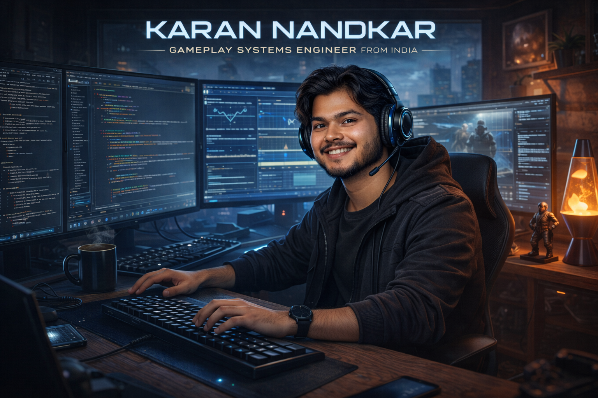

<h1 align="center">Hi 👋, I'm Karan Nandkar</h1>
<h3 align="center">Gameplay Engineer | Unity & Unreal Engine | Gameplay Systems • Performance • Mobile & PC</h3>

### 🚀 About Me
I’m a gameplay-focused software engineer with **8+ years of experience** building and shipping games across **Unity and Unreal Engine**.

I specialize in **gameplay systems, in-game UI, and performance-critical features**, with a strong focus on clean architecture, maintainability, and player experience. I enjoy owning features end to end — from early prototypes to production-ready, optimized systems.

My work often involves breaking down complex gameplay problems, collaborating closely with designers and artists, and ensuring systems scale well as projects grow.

I’m currently deepening my **Unreal Engine 5 and C++** expertise while continuing to ship complete, production-ready gameplay systems.

### 🔍 Current Focus & Contact
- 🔭 Currently working on an Unreal Engine project:  
  👉 [**Yaaro Ki Rasoi**](https://play.google.com/store/apps/details?id=com.p99softgamesstudio.yaarokirasoi)

- 💬 I can help with **gameplay programming, Unity/Unreal workflows, and performance optimization**

- 📫 Reach me via **Email**: knandkar007@gmail.com

- 📄 View my professional experience:  
  👉 [**Resume**](https://drive.google.com/file/d/1tLKF8Ygw_jDyMimhn4KnoMNT2IfTzbmF/view?usp=sharing)

- ⚡ Fun fact: I enjoy refactoring gameplay systems as much as building new ones.

### 🕹️ Featured Projects
- 🔫 **Ultimate Shooter (Unreal Engine)**  
  FPS mechanics, weapon systems and core gameplay loop  
  👉 [Github](https://github.com/CodeKaran13/UltimateShooter)

- 🌱 **EcoRun (Unity | Mobile)**  
  Endless runner with environmental mechanics, oxygen system, collectibles, and optimization  
  👉 [Play Store](https://play.google.com/store/apps/details?id=com.p99softgamestudio.projectinfinity)

- 🍳 **Yaaro Ki Rasoi (Unreal | Mobile)**  
  Time-management gameplay, UI systems, progression & monetization-ready design  
  👉 [Play Store](https://play.google.com/store/apps/details?id=com.p99softgamesstudio.yaarokirasoi)

### 🛠️ Tech Stack
**Game Engines:** Unity, Unreal Engine  
**Languages:** C#, C++ 
**Tools:** Git, Visual Studio, Rider  
**Platforms:** Mobile, PC

### 🎯 Currently Looking For
- Game Programmer roles (Unity / Unreal)
- Gameplay or Systems-focused teams
- Remote or global opportunities

<!--

-->

<!-- 
  
 -->

<!-- 
  
 -->

<h3 align="left">Connect with me:</h3>

<!-- <h3 align="left">Languages and Tools:</h3>

        
 -->

<!-- <h3 align="left">Support:</h3>

   -->

<!-- 

 -->

<!-- 

 -->
